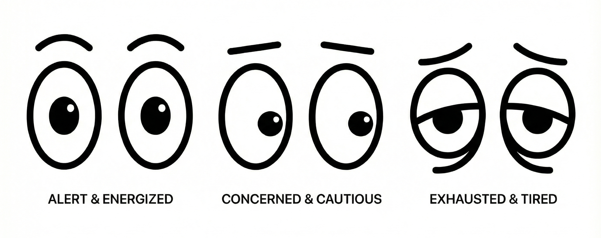

# Vibe Watch 👀

A playful macOS menu bar application that tracks your "vibe coding" time and helps you maintain a healthy work-life balance.

## Features

- **👀 Expressive Eye Icons**: Menu bar icon changes expression based on your coding time
  - Alert eyes: More than 1 hour remaining
  - Concerned eyes: Within 1 hour of limit
  - Exhausted eyes: Over your daily limit



- **⏱️ Smart Time Tracking**: Automatically tracks time spent in Cursor, Antigravity, and Terminal
  - Only counts time when you're actively coding (detects system idle time)
  - Tracks per-app breakdown
  - Hourly activity visualization

- **📊 Daily Limits**: Set different coding limits for weekdays vs. weekends
  - Default: 4 hours on weekdays, 2 hours on weekends
  - Adjustable in 15-minute increments
  - Immediate visual feedback in menu bar

- **📈 Historical Data**: View your coding patterns over time
  - Calendar heat map (coming soon)
  - Daily totals with app breakdown
  - Weekly summary chart
  - Export to CSV or JSON

- **⚙️ Customizable Settings**:
  - Per-day-of-week limits
  - Configurable idle threshold (default 3 minutes)
  - Launch at login (coming soon)

## Building from Source

### Requirements

- macOS 13.0 or later
- Xcode 15.0 or later
- Swift 5.9 or later

### Build Instructions

```bash
# Clone the repository
git clone https://github.com/nicoladevera/vibe-watch.git
cd vibe-watch

# Build with Swift Package Manager (Debug)
swift build

# Run the debug build
./.build/debug/VibeWatch

# Or build for release (recommended)
swift build --configuration release

# Run the release build
./.build/release/VibeWatch
```

### Building with Xcode

```bash
# Open Package.swift directly in Xcode
open Package.swift
```

Then press Cmd+R to build and run.

## Usage

1. **Launch the app**: The eye icon will appear in your menu bar
2. **Click the icon**: View today's stats, weekly summary, and access settings
3. **Set your limits**: Click Settings to configure daily coding limits
4. **View history**: Click "View History" to see your coding patterns
5. **Export data**: Export your data as CSV or JSON from the history view

## How It Works

Vibe Watch uses native macOS APIs to:
- Detect running applications (`NSWorkspace.shared.runningApplications`)
- Monitor system idle time (`ioreg -c IOHIDSystem`)
- Store data locally using SQLite (via GRDB.swift)

**Privacy**: All data is stored locally on your machine. No internet connection required. No telemetry or analytics.

## Architecture

```
Sources/VibeWatch/
├── Models/           # Data models (DailyRecord, TimeEntry, AppSettings)
├── Views/            # SwiftUI views (DropdownPanel, HistoryView, SettingsView)
└── Services/         # Business logic (TimeTracker, AppDetector, IdleMonitor, DataStore)
```

## Tracked Applications

- **Cursor**: The AI-powered code editor
- **Antigravity**: Google's IDE
- **Terminal**: macOS default terminal

Want to track other apps? Open an issue or submit a PR!

## Docs

- Quick start: `docs/guides/quick-start.md`
- Product requirements: `docs/product/prd.md`
- Task checklist: `docs/product/tasks.md`
- Debugging notes: `docs/debugging/`

## Roadmap

- [x] Custom eye icon illustrations
- [ ] Calendar heat map visualization
- [ ] Launch at login functionality
- [ ] Configurable app list
- [ ] Hourly activity chart
- [ ] Notifications (optional)
- [ ] Break reminders (optional)

## Contributing

Contributions are welcome! Please feel free to submit a Pull Request.

## License

MIT License - see LICENSE file for details

## Acknowledgments

- Built with Swift and SwiftUI
- Uses [GRDB.swift](https://github.com/groue/GRDB.swift) for SQLite persistence
- Eye icon concept inspired by watching over your coding sessions 👀

---

**Made with 💙 by developers, for developers**
